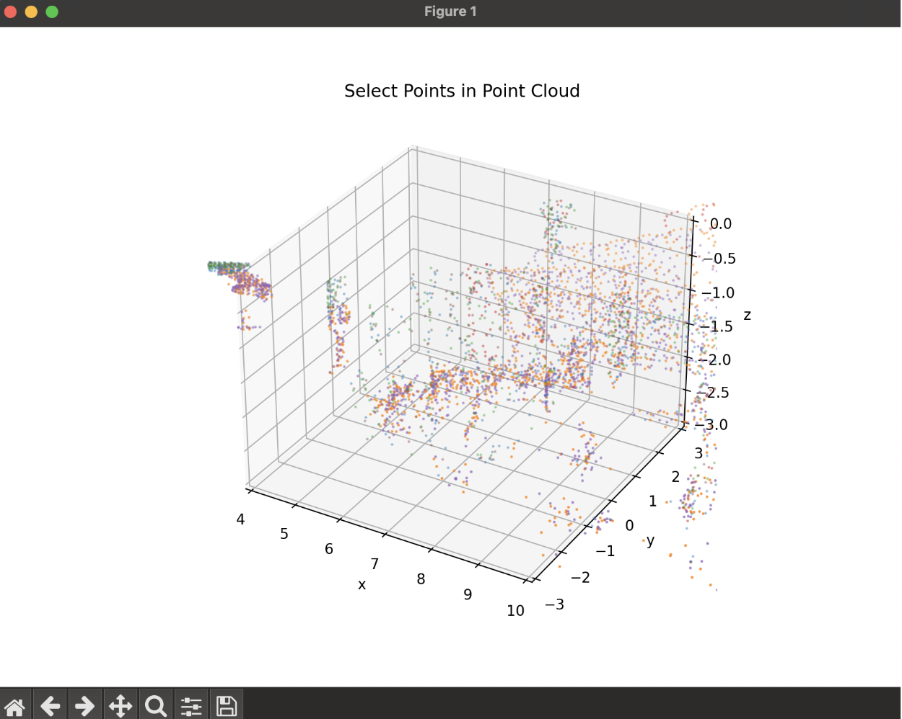

# RobotX Camera-LiDAR Calibration Guide

## Running the File:
1. Navigate to the main function of the `camera_lidar_calibration.py` file. Replace the placeholders as seen below with the relative paths for the user’s:

   - **Camera Matrix**
   - **LiDAR data** as a numpy array
   - **Corresponding Image file**
3. Ensure that `utils.py` is within the same directory as the `camera_lidar_calibration.py`.
4. Run `camera_lidar_calibration.py`.

## Using the File:
- When the file is run, the user will be asked to select key points on the image that will allow for the calibration to occur. **Note**: These points should be clearly distinguishable in both the LiDAR data and the image data. The user should select an even number of points, with at least four points, and ideally, they should represent multiple distances and depths.

    - The user will select these points by clicking on the image where they would like a point.
    - It is important to **remember the order** in which these points are selected, as the user will need to select the corresponding points in the same order on the LiDAR point cloud in the next step.
    - Once finished, press **`q`** to move to the next step.

- The user will then be asked to select the corresponding LiDAR points that align with the selected points on the image.

    - To do this, the user will move a red dot through the LiDAR point cloud and select the location of the chosen points in 3D space.
    - Use the following keys to move the current point:
        - **Up Arrow**: Increase Z-coordinate (move upward)
        - **Down Arrow**: Decrease Z-coordinate (move downward)
        - **Left Arrow**: Decrease Y-coordinate (move left)
        - **Right Arrow**: Increase Y-coordinate (move right)
        - **`,` Key**: Decrease X-coordinate (move backward)
        - **`.` Key**: Increase X-coordinate (move forward)
    - Use the **scroll wheel** to zoom in and out.
    - **Click and drag** on the point cloud to rotate it.
    - Press **Enter** to select the current point and save it.
    - Press **`q`** to exit the point selection process.

- After the points are selected, the transformation matrix will be printed to the console for further use.
    - The transformation matrix is represented in the following form:
    
        - The elements labelled **`r`** make up a 3x3 rotation matrix.
        - The elements labelled **`t`** make up a 3x1 translation vector.